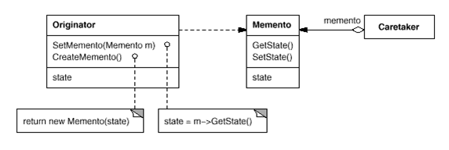

# 문제
## [게임] 주사위 게임으로 돈과 과일 모으기
- 이 게임은 자동으로 100번 진행됩니다.
- Gamer의 초기 금액은 1000 입니다
- Gamer는 돈과 과일[사과, 샤인머스킷, 귤]을 가질 수 있습니다.
- 주사위를 던져 나온 수가 Gamer의 다음 상태를 결정합니다. (java.util.Random 사용)
  - 1,3이 나오면 Gamer의 돈이 100 증가합니다. 
  - 2,4 가 나오면 돈이 반으로 줄어듭니다. 
  - 6 이 나오면 돈은 변화 없고, Gamer는 과일 중 하나를 받습니다. (순차적으로)
- 돈이 다 없어지면 종료합니다.
- 이대로 하면 돈이 금방 없어질 수 있으므로 복원할 수 있는 객체를 하나두었습니다.
- 기억하는 객체를 하나 둡니다. (Memento) - 여러개로 관리하지 않습니다.
- Gamer의 돈이 Memento보다 늘어나면 그 상태를 Memento 객체에 저장합니다. (createMemento)
- Gamer가 가진돈이 Memento가 가진 돈의 절반(1/2)보다 작으면 Gamer의 상태를 Memento가 가진 돈과 과일로 복귀합니다. (restoreMemento)

- 매번 주사위가 던져질 때마다 Gamer의 상태를 출력하세요
- **이 과제를 잘못 구현하게 되면 캡슐화에 위배될 수 있는 이유를 생각해보세요**

