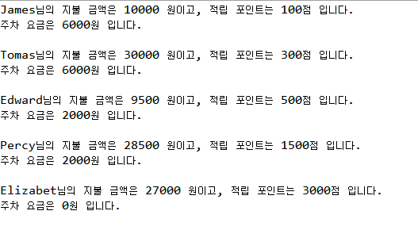

# 문제1

백화점에서 멤버십을 관리하는 프로그램을 개발하고 있습니다. 고객은 매출의 충성도에 따라 등급을 나누게 됩니다.
고객은 RED, PLATINUM, DIAMOND 고객의 등급을 가지고 있습니다.
각 고객에게 제공되는 해택은 다음과 같습니다.

|고객 등급 |    혜택|    주차 요금 (시간당)|
|-----|---|------|
|RED|    할인률 적용 없음, 1% 포인트 적립|    3000원|
|PLATINUM| 5% 할인률 적용, 5% 포인트 적립 |1000원|
|DIAMOND| 10% 할인률 적용, 10%포인트 적립, 전문 상담원 배정 |무료|

5명의 고객에 대한 쇼핑정보가 아래와 같을 때 각 고객이 지불한 금액, 적립된 보너스 포인트, 주차요금을 계산하여 출력하세요

| 고객 이름   | 등급       |쇼핑 금액| 머문 시간|
|------------|----------|-------|--------|
| James      | RED      | 10000원| 2시간|
| Tomas      | RED      | 30000원| 2시간|
| Edward     | PLATINUM | 10000원 |2시간|
| Percy | PLATINUM |30000원| 2시간|
|Elizabet| DIAMOND| 30000원| 2시간|

## ( Hint )
상위 클래스를 Member로 정의하고 이를 상속받아 등급별로 고객 클래스를 만듭니다. 상위 클래스에 모든 Member가 공통으로 사용할 메서드를 정의(구현)합니다. 상위 클래스에 구현된 메서드의 기능이 하위
클래스에서 제공할 기능과 다르면 하위 클래스에서 재정의 합니다.

## [출력예]

## [더 생각해보기]
멤버에 등급이 더 늘어난다고 하면, 가령 원래는 없던 GOLD와 같은 등급이 추가된다고 할 때 현재 구현한 코드에서 수정해야 하는 부분이 어느 정도 인지 생각해보세요.
잘 설계된 객체지향 코드가 유지보수와 확장성에 좋은 이유에 대해 알게됩니다

#상속 #업캐스팅 #가상메서드 #오버라이딩 #다형성