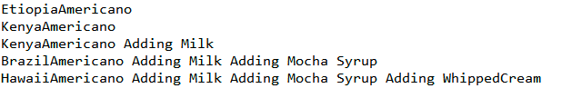

# 문제 2

여기는 커피 매장입니다. 우리 매장에서는 여러 종류의 메뉴를 제공합니다. 원두에 따라 아메리카노는 기본으로 제공되는 메뉴입니다.
아메리카노에 다른 재료들이 추가되어 여러가지 커피가 완성됩니다.
메뉴 제조 과정은 다음과 같습니다.

- 라떼 = 아메리카노 + 우유
- 모카커피 = 아메키라노 + 우유 + 모카시럽
- 휘핑크림이올라간 모카커피 = 아메키라노 + 우유 + 모카시럽 + 휘핑크림

이 매장에서 제공되는 커피의 메뉴는 다음과 같습니다.

|원두 종류|    메뉴|
|-----|------|
|에티오피타|아메리카노, 라떼, 모카커피|
|케냐   |아메리카노, 라떼|
|브라질  |아메리카노, 라떼, 모카커피|
|하와이  |아메리카노, 라떼, 모카커피, 휘핑크림이 올라간 모카커피|

다음 클라이언트 코드가 실행되고
```java
public class CoffeeTest {
	public static void main(String[] args) {

		Coffee etiopiaAmericano = new EtiopiaAmericano();
		etiopiaAmericano.brewing();
		System.out.println();
				
		Coffee kenyaAmericano = new KenyaAmericano();
		kenyaAmericano.brewing();
		System.out.println();
		
		Coffee kenyaLatte = new Latte(kenyaAmericano);
		kenyaLatte.brewing();
		System.out.println();
		
		Coffee brazilMocha = new Mocha(new Latte(new BrazilAmericano()));
		brazilMocha.brewing();
		System.out.println();
		
		Coffee hawaiiWhippedMocha = 
				new WhippedCream(new Mocha(new Latte( new HawaiiAmericano())));
		hawaiiWhippedMocha.brewing();
		System.out.println();
		
	}
}
```

다음과 같은 결과가 출력되도록 완성하세요



## 더 생각해보기
더 많은 원두의 아메리카노가 제공되고 여기에 더 많은 종류의 시럽이나 장식들이 추가된다고 할 때 지금 만들어진 코드가 확장성이 좋은지 한번 살펴보세요

#데코레이터