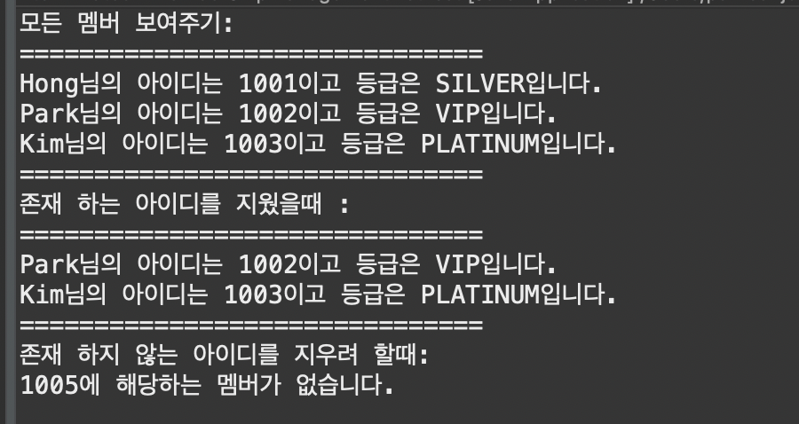

# [문제 1]
- 이전에 만든 멤버십 클래스들을 사용합니다. 다음 메인 코드가 실행되고 그 결과가 예시와 같이 출력 될 수 있도록 구현하세요.
- 단, ArrayList를 활용합니다.

```java
public class MemberShipManagementListTest {

	public static void main(String[] args) {

		
		MemberShipMangementList management = new MemberShipMangementList();
		management.addMemberShip(1001, "Hong", GRADE.SILVER);
		management.addMemberShip(1002, "Park", GRADE.VIP);
		management.addMemberShip(1003, "Kim", GRADE.PLATINUM);
		
		System.out.println("모든 멤버 보여주기: ");
		management.showAllMember();
		
		System.out.println("존재 하는 아이디를 지웠을때 :");
		if(management.removeMember(1001)) {
			management.showAllMember();
		}
		
		System.out.println("존재 하지 않는 아이디를 지우려 할때:");
		if(management.removeMember(1005)) {
			management.showAllMember();
		}	
	}
}
```



`#일급컬렉션`

# 요구사항 정리
1. MemberShipManagementList 클래스
   1. [x] addMemberShip(member) : 멤버 추가
   2. [x] showAllMember() : 모든 멤버 리스트 출력
   3. [x] removeMember(id) : 멤버 삭제
      1. [x] 멤버 삭제 결과 성공시 true
      2. [x] 멤버 삭제 결과 실패시 false
      3. [x] 멤버 삭제 결과 실패시 에러메시지