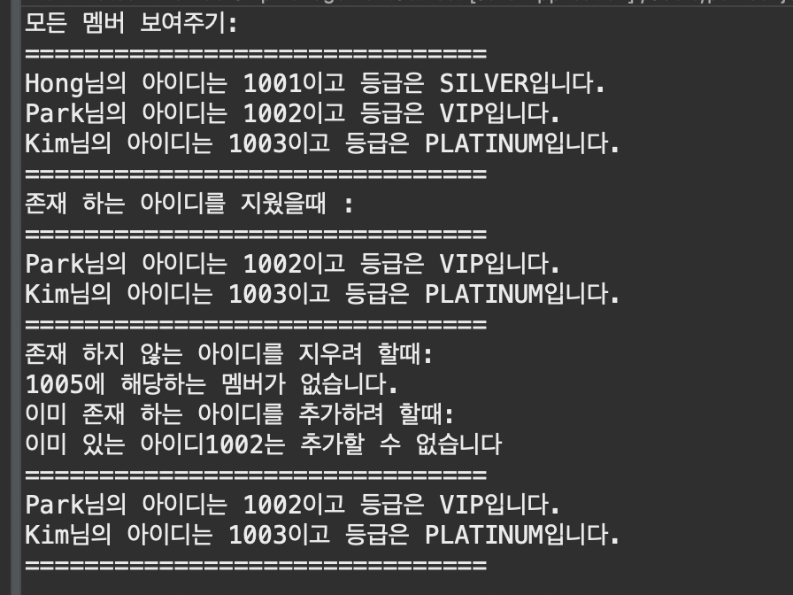

# [문제 2]
- HashSet을 활용하여 같은 아이디를 가진 경우 멤버십이 추가되지 않도록 구현합니다.
- 다음 메인 코드가 실행되고 그 결과가 예시와 같이 출력 될 수 있도록 구현하세요.

# [주의]
- MemberShipMangementSet 클래스의 addMemberShip()메서드에서 같은 아이디인 경우 추가하지 않는 코드를 구현하는 것이 아닙니다.
- Set인터페이스의 명세를 잘 읽어보고 같은 객체인지 여부를 판단하는 방법을 구현하시면 됩니다.

```java
public class MemberShipManagementSetTest {

	public static void main(String[] args) {

		
		MemberShipMangementSet management = new MemberShipMangementSet();
		management.addMemberShip(1001, "Hong", GRADE.SILVER);
		management.addMemberShip(1002, "Park", GRADE.VIP);
		management.addMemberShip(1003, "Kim", GRADE.PLATINUM);
		
		System.out.println("모든 멤버 보여주기: ");
		management.showAllMember();
		
		System.out.println("존재 하는 아이디를 지웠을때 :");
		if(management.removeMember(1001)) {
			management.showAllMember();
		}
		
		System.out.println("존재 하지 않는 아이디를 지우려 할때:");
		if(management.removeMember(1005)) {
			management.showAllMember();
		}
		
		System.out.println("이미 존재 하는 아이드를 추가하려 할때:");
		management.addMemberShip(1002, "Lee", GRADE.VIP);
		
		management.showAllMember();
	}
}
```



#Hash #Key의_의미 #Set에서유일한값을구별하는방법